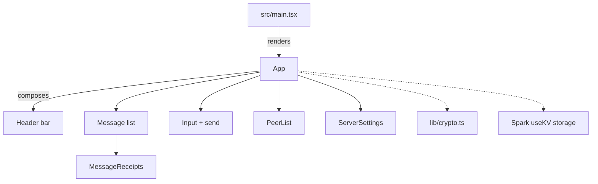
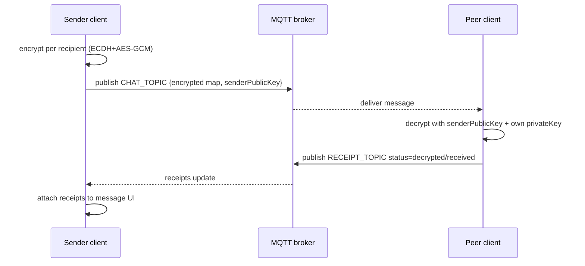
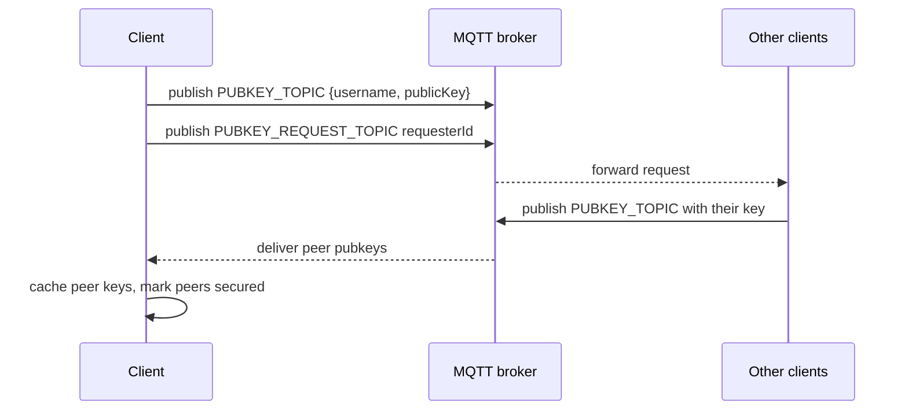
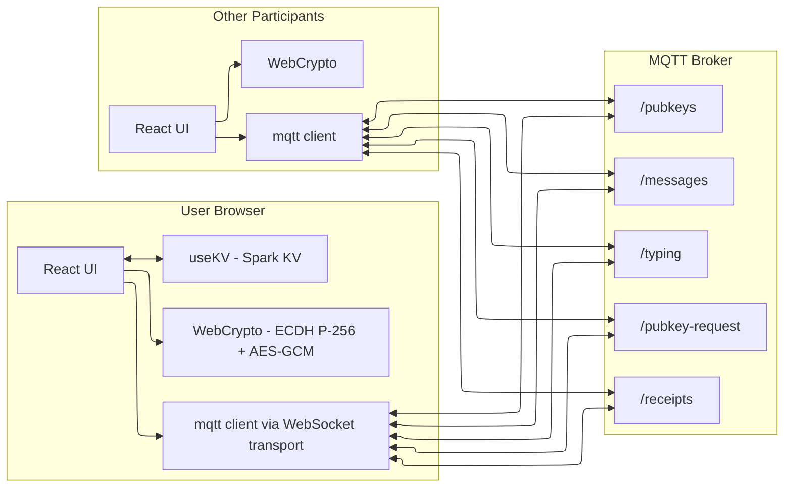
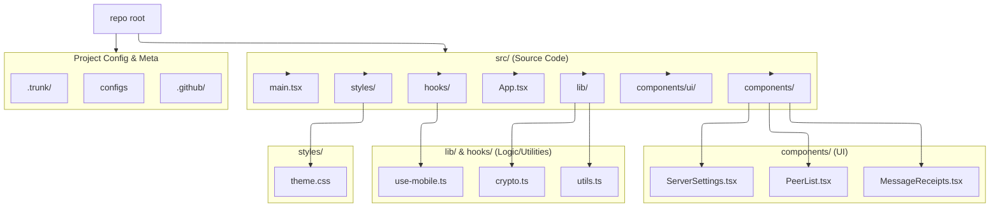

# Chat Codebase Guide

> **Note**: This file is used by the automated Claude Code Review workflow (`.github/workflows/claude-code-review.yml`) 
> to provide context about project conventions, architecture, and coding standards when reviewing pull requests.
> Keep this file updated with important architectural decisions, coding patterns, and contribution guidelines.

## PRD

There is a Product Requirements Document in [PRD.md](/PRD.md). It should be read alongside this documentation.

## TL;DR

- React + Vite + SWC + Tailwind (shadcn preset) + GitHub Spark plugin.
- Stateful MQTT chat with end-to-end encryption (ECDH P-256 + AES-GCM) and per-peer delivery receipts.
- Persisted client settings via Spark `useKV` (username and broker config).

## How It's Wired

- Entry: `src/main.tsx` mounts `<App />` inside `react-error-boundary` (dev rethrows to surface errors).
- Vite config: `vite.config.ts` adds Spark plugin, Tailwind plugin, and Phosphor icon proxy; alias `@` → `src`.
- Styling: Tailwind config merges `theme.json` if present; uses CSS variables for color/spacing; main styles in `src/main.css`, `src/styles/theme.css`, `src/index.css`.
- UI kit: shadcn components in `src/components/ui/*`; `lib/utils.ts` exports `cn` helper.

### Core Runtime (`src/App.tsx`)

- State: MQTT config (`useKV`), username (`useKV`), keypair, peers map (username → {hasPublicKey,lastSeen}), peer public keys map, message list, typing users, connection status, MQTT client.
- MQTT topics derived from `topicPrefix`: `messages`, `typing`, `pubkeys`, `pubkey-request`, `receipts`.
- Lifecycle:
  - On mount: generate ECDH P-256 keypair, export public key, set random username if empty, connect to broker.
  - Connect: create client with random clientId, subscribe to topics, announce own public key and request others.
  - Handlers:
    - `messages`: decrypt per-recipient ciphertext (AES-GCM using derived shared key), add message, send receipt (`received`/`decrypted`).
    - `typing`: track typing map; import missing public keys; update peer list.
    - `pubkeys`: import/store peer keys; mark peer secure.
    - `pubkey-request`: re-announce key.
    - `receipts`: attach per-user receipt status to sent messages.
  - Sending: encrypt plaintext for each known public key + self, publish encrypted payload, append local plaintext message, stop typing.
  - Typing: throttled publish of typing events; timeout clears.
  - Reconnect/change server: end client, clear peer/message state, reconnect.
- Rendering:
  - Left: chat header (username edit, E2EE badge, connection badge, server settings, reconnect), scrollable messages with receipts, typing indicator, composer + helper commands.
  - Right: `<PeerList>` shows peers and key possession, with "Request Keys".
  - `<MessageReceipts>` shows per-message delivery/decrypt counts with tooltip details.
  - `<ServerSettings>` dialog edits broker URL/port/topic prefix and triggers reconnect.

### Crypto (`src/lib/crypto.ts`)

- ECDH P-256 keypair, export/import SPKI public keys (base64).
- `deriveSharedKey` -> AES-GCM 256 key per recipient.
- `encryptMessage` loops recipients, encrypts with random IV, returns base64(iv+ciphertext) map keyed by recipient index (caller maps to public keys).
- `decryptMessage` reverses to plaintext with sender pubkey + own private key.

### Hooks

- `useIsMobile` detects viewport < 768px via `matchMedia`.

### Data & State Persistence

- Spark `useKV` stores MQTT server config (`mqtt-server-config`) and username (`mqtt-chat-username`) in KV (see `spark.meta.json` dbType kv).

## Commands

- Dev: `bun run dev` (or `npm run dev` if using npm).
- Build: `bun run build` (tsc project build + `vite build`).
- Lint: `bun run lint`.

## Diagrams

### Component/Data Graph



### Message Lifecycle (Publish/Decrypt/Receipts)



### Public Key Distribution



## Contribution Notes

- Respect minimal state resets on reconnect (`handleServerConfigSave`, `handleReconnect`).
- Preserve receipt semantics: only upgrade receipt status to `decrypted`.
- Keep per-peer maps immutable when updating state to avoid stale renders.
- When adding topics/features, extend both publish and on-message handlers symmetrically.
- ErrorBoundary rethrows in dev; rely on parent dev tooling for errors.

---

## 1. Project Overview

- **Project type**: Frontend-only single-page web app (SPA) — an end-to-end encrypted "MQTT chat room" that communicates via MQTT over WebSockets.
- **Primary use case**: Real-time multi-user chat using a public MQTT broker, with typing indicators, peer list/key status, and delivery/decrypt receipts.
- **Tech stack**:
  - **Runtime**: Browser (WebCrypto + WebSockets)
  - **Frontend**: React 19 + ReactDOM 19, TypeScript
  - **Build**: Vite 7, SWC React plugin (`@vitejs/plugin-react-swc`)
  - **Styling/UI**: Tailwind CSS v4, shadcn/ui (Radix primitives), `tw-animate-css`, icons (Phosphor + Lucide)
  - **Realtime transport**: `mqtt` npm package connecting to `wss://…` brokers
  - **Animations**: `framer-motion`
  - **State persistence**: GitHub Spark KV via `@github/spark/hooks` (`useKV`)
- **Architecture pattern**: Client-only "event-driven" architecture (MQTT pub/sub). No server/API layer in this repo.
- **Languages / versions**:
  - **TypeScript**: `~5.9.3`
  - **Node** (tooling engine): `^25.2.1`
  - **Bun** (package manager): `^1.3.4` (`packageManager`: `bun@1.3.4`)

## 2. Detailed Directory Structure Analysis

### `.github/`

- **Purpose**: Repo automation.
- **Key files**:
  - `dependabot.yml`: dependency update configuration.

### `.trunk/`

- **Purpose**: Trunk-based tooling configuration (linting/formatting automation).
- **Key files**:
  - `trunk.yaml`, `configs/*`: lint configuration files.

### `src/`

- **Purpose**: Application source code.
- **Key areas**:
  - **Entrypoints**: `main.tsx` (bootstraps React + error boundary)
  - **Main UI**: `App.tsx` (MQTT connection, key exchange, encryption, UI)
  - **Domain components**: `components/PeerList.tsx`, `components/ServerSettings.tsx`, `components/MessageReceipts.tsx`
  - **UI kit**: `components/ui/*` (shadcn/ui components built on Radix)
  - **Crypto**: `lib/crypto.ts` (ECDH + AES-GCM + base64 helpers)
  - **Utilities**: `lib/utils.ts` (`cn()` tailwind class combiner)
  - **Hooks**: `hooks/use-mobile.ts` (`useIsMobile()`)
  - **Styles**: `main.css`, `index.css`, `styles/theme.css`

### Root Files

- **`index.html`**: Vite HTML entry, loads `src/main.tsx` and `src/main.css`.
- **`package.json`**: dependencies, engines, scripts.
- **`vite.config.ts`**: Vite plugins + `@` alias.
- **`tailwind.config.js`**: Tailwind v4 config; merges in `theme.json` if present.
- **`theme.json`**: empty in this repo (hook for custom theme overrides).
- **`runtime.config.json` / `spark.meta.json`**: GitHub Spark runtime metadata (KV-backed template).

## 3. File-by-File Breakdown

### Core Application Files

- **`index.html`**: Sets the document shell and loads the app entry module.
- **`src/main.tsx`**:
  - Imports `@github/spark/spark` (Spark runtime integration).
  - Mounts `App` under a `react-error-boundary` boundary.
  - Loads global styles.
- **`src/App.tsx`**:
  - Generates a WebCrypto ECDH P-256 keypair on mount.
  - Connects to an MQTT broker over WebSockets.
  - Subscribes to topics for messages, typing events, public key announcements, key requests, and receipts.
  - Maintains in-memory state for:
    - messages
    - peers + whether they have a known public key
    - typing indicators (with timeout expiry)
    - per-message receipt maps
  - Uses Spark KV (`useKV`) to persist:
    - MQTT server config (`mqtt-server-config`)
    - username (`mqtt-chat-username`)
- **`src/ErrorFallback.tsx`**:
  - Rethrows errors in dev (`import.meta.env.DEV`) for better dev UX.
  - Shows a user-facing error screen in prod.

### Configuration Files

- **`package.json`**:
  - Scripts: `dev`, `build`, `preview`, `lint`.
  - Engines: Bun + Node.
  - Notable deps: `mqtt`, `@github/spark`, `next-themes` (installed but not obviously used in the snippets reviewed).
- **`tsconfig.json`**:
  - Bundler resolution, `jsx: react-jsx`, path alias `@/*` → `src/*`.
- **`vite.config.ts`**:
  - Plugins: React SWC, Tailwind v4 Vite plugin, Spark Vite plugins.
  - Alias: `@` → `<projectRoot>/src`.
- **`tailwind.config.js`**:
  - Uses CSS variables and a Radix-style token palette.
  - Merges an optional `theme.json` override.

### Data Layer (Local Persistence)

- **Spark KV** (no local DB/migrations in repo):
  - `useKV("mqtt-server-config", …)`
  - `useKV("mqtt-chat-username", …)`

### Frontend/UI

- **Domain components**:
  - `src/components/PeerList.tsx`: renders peer list + key status + manual "Request Keys".
  - `src/components/ServerSettings.tsx`: modal settings for broker URL, port, topic prefix.
  - `src/components/MessageReceipts.tsx`: small per-message receipt indicator + tooltip.
- **UI system (`src/components/ui/*`)**:
  - shadcn/ui style components (Button, Card, Dialog, Input, ScrollArea, Badge, etc.).
  - Built on Radix primitives + Tailwind utility classes.
- **Styling**:
  - `src/main.css`: Tailwind config glue + CSS variables for light/dark + base styles.
  - `src/index.css`: base layers and font variables.
  - `src/styles/theme.css`: Spark theming tokens + Radix color imports.

### Testing

- **No test suite discovered** in this snapshot (no `tests/`, `*.spec.*`, `jest/vitest` config).

### Documentation

- **No `README.md`** found in this worktree.
- License present: `LICENSE` (MIT).

### DevOps / CI

- **Dependabot** configured under `.github/`.
- **Trunk** configuration present under `.trunk/`.

## 4. API Endpoints Analysis

There are **no HTTP API endpoints** in this repo. The "API surface" is the set of MQTT topics and their message schemas.

### MQTT Topics (Acts Like Endpoints)

Assuming `topicPrefix` default `spark-chat-room`:

#### `<prefix>/messages`

- **Direction**: pub/sub
- **Payload**: `EncryptedMessage`
- **Schema**:

```ts
type EncryptedMessage = {
  id: string;
  username: string;
  encrypted: { [recipientKey: string]: string }; // base64(iv+ciphertext) per recipient pubkey string
  timestamp: number;
  senderPublicKey: string; // SerializedPublicKey
};
```

#### `<prefix>/typing`

- **Direction**: pub/sub
- **Payload**: `TypingEvent`

```ts
type TypingEvent = {
  username: string;
  isTyping: boolean;
  timestamp: number;
  publicKey: string; // SerializedPublicKey
};
```

#### `<prefix>/pubkeys`

- **Direction**: pub/sub
- **Payload**: `PublicKeyAnnouncement`

```ts
type PublicKeyAnnouncement = {
  username: string;
  publicKey: string; // SerializedPublicKey
  timestamp: number;
};
```

#### `<prefix>/pubkey-request`

- **Direction**: pub/sub
- **Payload**: `PublicKeyRequest`

```ts
type PublicKeyRequest = {
  requesterId: string;
  timestamp: number;
};
```

#### `<prefix>/receipts`

- **Direction**: pub/sub
- **Payload**: `DeliveryReceipt`

```ts
type ReceiptStatus = "sent" | "received" | "decrypted";

type DeliveryReceipt = {
  messageId: string;
  username: string;
  status: ReceiptStatus;
  timestamp: number;
};
```

### Authentication / Authorization

- **None at protocol level**: the app connects to arbitrary brokers (default public Mosquitto test broker) without auth.
- **Identity**: "username" is user-provided and not cryptographically bound to a key.

### Request/Response Formats

- All MQTT payloads are **JSON strings**.

### Versioning Strategy

- No explicit versioning for message schemas or topics.

## 5. Architecture Deep Dive

### High-Level Architecture

- Browser app connects to an MQTT broker via WebSockets.
- Messages are published and received using MQTT topics.
- End-to-end encryption is performed entirely in the browser.
- A small amount of config is persisted via GitHub Spark KV.

### Data Flow and Lifecycle

1. **Startup**
   - Generate ECDH P-256 keypair.
   - Export public key (SPKI → base64).
   - Connect to broker and subscribe to all relevant topics.

2. **Key discovery / peer awareness**
   - Publish your public key announcement.
   - Publish a "pubkey-request" so others will re-announce.
   - Track peers when receiving typing events / messages / pubkey announcements.

3. **Sending a message**
   - Build recipient list from known peer public keys + self key.
   - For each recipient, derive a shared AES-GCM key via ECDH and encrypt with a fresh random IV.
   - Publish a single MQTT message containing a map from recipient public key string → ciphertext.
   - Optimistically add plaintext to local UI.

4. **Receiving a message**
   - Ignore if `encryptedMsg.username === displayUsername` (self).
   - Ensure sender public key is imported and stored.
   - If message does not include `encrypted[myPublicKeyString]`, treat as "not for me" and send a receipt.
   - Otherwise decrypt using derived shared key and update messages.

5. **Receipts**
   - Recipients publish to `<prefix>/receipts` with status `received` or `decrypted`.
   - Senders attach receipts to their own messages for UI display.

### Key Design Patterns

- **Pub/Sub + event handlers**: MQTT topics replace typical HTTP endpoints.
- **Local-first UI state**: React state holds message list and maps.
- **KV persistence**: Spark KV stores user config / identity.

### Module Dependencies (Not Exhaustive)

- `App.tsx` depends on:
  - `mqtt` for broker connection
  - `lib/crypto.ts` for E2EE
  - UI components under `components/` and `components/ui/`
  - Spark KV hooks for persistence

## 6. Environment & Setup Analysis

### Environment Variables

- None are required to run locally by default.
- Vite config reads `process.env.PROJECT_ROOT` (optional) to compute alias root.
- `src/vite-end.d.ts` declares Spark-provided runtime globals:
  - `GITHUB_RUNTIME_PERMANENT_NAME`
  - `BASE_KV_SERVICE_URL`

### Install and Run

```bash
bun install
bun run dev
```

Build and preview:

```bash
bun run build
bun run preview
```

### Development Workflow

- Edit React/TS in `src/`, Vite handles HMR.
- Tailwind v4 is configured via `@tailwindcss/vite` and CSS `@config` in `src/main.css`.

### Production Deployment Strategy

- Vite produces static assets (`vite build`).
- The Spark plugins suggest this is intended to run within GitHub Spark hosting/runtime (KV-backed), but it can also be served as a static SPA if Spark-specific runtime requirements are satisfied.

## 7. Technology Stack Breakdown

- **Runtime environment**: Browser (WebSockets + WebCrypto)
- **Frameworks/libraries**:
  - React 19
  - `mqtt` (MQTT client)
  - `@github/spark` (runtime + KV hooks)
  - Radix UI + shadcn/ui
  - Tailwind CSS v4 + `tailwind-merge` + `clsx`
  - framer-motion
  - zod (present; not obviously used in files reviewed)
- **Build tools**:
  - Vite 7
  - SWC React plugin
  - Tailwind Vite plugin
- **Testing**:
  - None configured in this snapshot.
- **Deployment**:
  - Static build output (Vite) + (optionally) GitHub Spark runtime services.

## 8. Visual Architecture Diagrams

### System Architecture



### File Structure Hierarchy



## 9. Key Insights & Recommendations

### Code Quality Assessment

- **Strengths**:
  - Clear topic separation (`messages`, `typing`, `pubkeys`, `receipts`).
  - Reasonable UI/UX: status badges, settings dialog, receipts tooltip, peer list.
  - Uses WebCrypto correctly at a high level (ECDH-derived AES-GCM + random IV per encryption).
- **Gaps**:
  - Large `App.tsx` (transport + crypto + state + UI all in one file).
  - No automated tests.

### Security Considerations (High Priority)

- **Identity is not authenticated**: usernames can be spoofed; public keys are not bound to usernames.
  - Recommendation: introduce a notion of identity (e.g., stable client ID + signed key announcements) or an out-of-band trust model.
- **No message signing**: recipients cannot verify who authored a message; they only derive keys based on the claimed sender key.
  - Recommendation: add digital signatures (e.g., ECDSA P-256) over message metadata and ciphertext map.
- **No forward secrecy / rotation**: a single long-lived ECDH keypair per session means compromise impacts all messages in that session.
  - Recommendation: use ephemeral keys per session/room or rotate keys periodically; consider per-message ratcheting (more complex).
- **Receipt semantics leak metadata**: receipts and typing events reveal presence/activity.
  - Recommendation: document this clearly; optionally add a "privacy mode" to disable receipts/typing.

### Performance Optimization Opportunities

- **Encryption cost scales with peer count**: one encryption per recipient per message.
  - Recommendation: for larger rooms, consider group encryption strategies (e.g., shared room key exchanged via ECDH) or hybrid approaches.
- **State updates in maps**: frequent `new Map()` and map mutations can be OK, but watch for unnecessary re-renders.

### Maintainability Suggestions

- **Refactor `App.tsx` into modules**:
  - `mqttClient.ts` (connect/subscribe/publish helpers)
  - `protocol.ts` (topic names + Zod schemas)
  - `chatState.ts` (reducers for messages/peers/typing)
  - `crypto.ts` already exists; could expand to include signature/key-rotation helpers
- **Add schema validation**:
  - Zod is already installed; validate incoming MQTT payloads to avoid runtime crashes and weird state.
- **Add tests**:
  - Unit tests for crypto helpers and protocol parsing.
  - Lightweight component tests for receipt/peer rendering.

### Deployment / Ops Notes

- Default broker is a public test broker; expect instability and no guarantees.
  - Recommendation: provide guidance for running a private broker and enabling auth/TLS.
