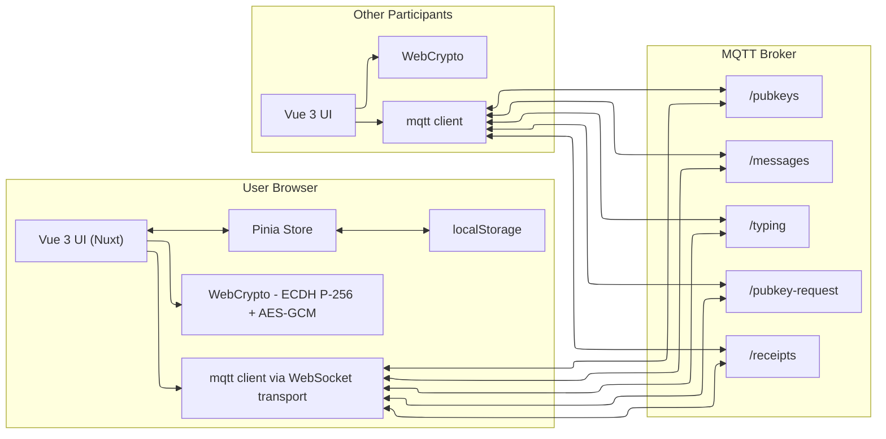
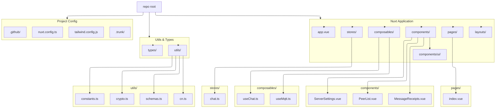

# Chat Codebase Guide

> **Note**: This file is also used by the automated Claude Code Review workflow (`.github/workflows/claude-code-review.yml`)
> to provide context about project conventions, architecture, and coding standards when reviewing pull requests.
> Keep this file updated with important architectural decisions, coding patterns, and contribution guidelines.

## PRD

There is a Product Requirements Document in `PRD.md` in the root of the repository. It should be read alongside this documentation.

## TL;DR

- Nuxt 4 + Vue 3 + Pinia + Tailwind CSS v4.
- Stateful MQTT chat with end-to-end encryption (ECDH P-256 + AES-GCM) and per-peer delivery receipts.
- Persisted client settings via Pinia + localStorage (username and broker config).
- Zod schema validation for all MQTT messages.

## How It's Wired

- Entry: `app.vue` serves as Nuxt app root with default layout.
- Main page: `pages/index.vue` implements the chat UI using Vue Composition API.
- Nuxt config: `nuxt.config.ts` configures Tailwind, Pinia, VueUse modules; SSR disabled (client-only).
- Styling: Tailwind CSS v4 with custom configuration; main styles in `assets/css/main.css`.
- UI kit: Custom Vue components in `components/ui/*`; `utils/cn.ts` exports `cn` helper.
- State management: Pinia store in `stores/chat.ts` with localStorage persistence.
- Composables: Vue composables in `composables/` for MQTT and chat orchestration.
- Types: TypeScript definitions in `types/index.ts`.
- Validation: Zod schemas in `utils/schemas.ts` validate all MQTT messages.

### Core Runtime

#### State Management (`stores/chat.ts`)

- Pinia store with refs and computed properties.
- Persisted state: MQTT config (broker URL, port, topic prefix) and username stored in localStorage.
- Reactive state: keypair, connection status, messages array, peers Map (using `shallowReactive`), peer public keys Map, typing users Map.
- MQTT topics computed from `topicPrefix`: `messages`, `typing`, `pubkeys`, `pubkey-request`, `receipts`.
- Actions for managing messages, receipts, peers, typing indicators, and reconnection.

#### MQTT Communication (`composables/useMqtt.ts`)

- Lifecycle:
  - Connect: create MQTT client with random clientId, subscribe to topics, announce own public key and request others.
  - Message handlers validate payloads with Zod schemas before processing:
    - `messages`: validate, decrypt per-recipient ciphertext (AES-GCM using derived shared key), add message, send receipt (`received`/`decrypted`).
    - `typing`: validate, track typing map; import missing public keys; update peer list.
    - `pubkeys`: validate, import/store peer keys; mark peer secure.
    - `pubkey-request`: validate, re-announce key.
    - `receipts`: validate, attach per-user receipt status to sent messages.
  - Sending: encrypt plaintext for each known public key + self, publish encrypted payload, append local plaintext message, stop typing.
  - Typing: throttled publish (1000ms) of typing events; timeout (3000ms) clears indicator.
  - Disconnect: properly cleans up typing timeouts to prevent memory leaks.
  - Reconnect/change server: end client, clear peer/message state, reconnect.
- Error handling: console errors wrapped in `import.meta.dev` checks for production.

#### Chat Orchestration (`composables/useChat.ts`)

- Initializes store from localStorage.
- Generates ECDH P-256 keypair on mount, exports public key.
- Manages MQTT connection lifecycle via `useMqtt`.
- Provides helper utilities for timestamps, avatar colors, typing text.
- Handles server config changes and manual key requests.

#### Main UI (`pages/index.vue`)

- Vue SFC using Composition API.
- Layout:
  - Header: username edit, E2EE badge, connection badge, server settings, reconnect button.
  - Main: scrollable messages with receipts, typing indicator, message composer.
  - Sidebar: `<PeerList>` shows peers and key possession, with "Request Keys" button.
- Components:
  - `<MessageReceipts>` shows per-message delivery/decrypt counts with tooltip details.
  - `<ServerSettings>` dialog edits broker URL/port/topic prefix and triggers reconnect.
  - `<PeerList>` displays peer status with key indicators.

### Crypto (`utils/crypto.ts`)

- ECDH P-256 keypair generation via WebCrypto API.
- Export/import SPKI public keys (base64 encoded).
- `deriveSharedKey` -> AES-GCM 256 key per recipient using ECDH.
- `encryptMessage` loops recipients, encrypts with random IV, returns base64(iv+ciphertext) array.
- `decryptMessage` reverses to plaintext with sender pubkey + own private key.

### Constants (`utils/constants.ts`)

- Centralized configuration values:
  - Typing timeouts: `TYPING_THROTTLE_MS` (1000), `TYPING_TIMEOUT_MS` (3000), `TYPING_EXPIRY_MS` (3000)
  - Default MQTT config: broker URL, port, topic prefix
  - localStorage keys

### Validation (`utils/schemas.ts`)

- Zod schemas for all MQTT message types:
  - `EncryptedMessageSchema`
  - `TypingEventSchema`
  - `PublicKeyAnnouncementSchema`
  - `PublicKeyRequestSchema`
  - `DeliveryReceiptSchema`
- Schemas validated with `.safeParse()` before processing incoming messages.

### Data & State Persistence

- Pinia store persists MQTT server config (`mqtt-server-config`) and username (`mqtt-chat-username`) to localStorage.
- State automatically loaded on initialization via `loadFromStorage()` action.

## Commands

- Dev: `bun run dev` - Start Nuxt dev server
- Build: `bun run build` - Build for production
- Generate: `bun run generate` - Generate static site
- Preview: `bun run preview` - Preview production build
- Typecheck: `bun run typecheck` - Run TypeScript type checking
- Lint: `bun run lint` - Run Trunk linter
- Format: `bun run format` - Format code with Prettier and Trunk

## Diagrams

### Component/Data Graph


### Message Lifecycle (Publish/Decrypt/Receipts)


### Public Key Distribution


## Contribution Notes

- **State management**: Use Pinia store actions for all state mutations; avoid direct mutations.
- **Map reactivity**: Peer maps use `shallowReactive` for Vue reactivity; use `.set()`, `.delete()`, `.clear()` directly.
- **Validation**: All incoming MQTT messages must be validated with Zod schemas before processing.
- **Error handling**: Wrap console logs in `import.meta.dev` checks to prevent logs in production.
- **Constants**: Use centralized constants from `utils/constants.ts` for magic numbers and config values.
- **Memory leaks**: Always clean up timers and subscriptions in disconnect/cleanup functions.
- **Reconnection**: Respect minimal state resets on reconnect (`resetForReconnection`).
- **Receipt semantics**: Only upgrade receipt status to `decrypted` (never downgrade).
- **Topics/features**: When adding MQTT topics, extend both publish and handler logic symmetrically.
- **Type safety**: Maintain strict TypeScript typing; use types from `types/index.ts`.

---

## 1. Project Overview

- **Project type**: Frontend-only single-page web app (SPA) — an end-to-end encrypted "MQTT chat room" that communicates via MQTT over WebSockets.
- **Primary use case**: Real-time multi-user chat using a public MQTT broker, with typing indicators, peer list/key status, and delivery/decrypt receipts.
- **Tech stack**:
  - **Runtime**: Browser (WebCrypto + WebSockets)
  - **Frontend**: Nuxt 4 + Vue 3 (Composition API), TypeScript
  - **Build**: Nuxt (built on Vite)
  - **Styling/UI**: Tailwind CSS v4, custom Vue UI components, `tw-animate-css`
  - **State management**: Pinia (Vue store) with localStorage persistence
  - **Realtime transport**: `mqtt` npm package connecting to `wss://…` brokers
  - **Validation**: Zod for runtime schema validation
  - **Utilities**: VueUse for composable utilities
- **Architecture pattern**: Client-only "event-driven" architecture (MQTT pub/sub). No server/API layer in this repo.
- **Languages / versions**:
  - **TypeScript**: `~5.9.3`
  - **Node** (tooling engine): `^25.2.1`
  - **Bun** (package manager): `^1.3.4` (`packageManager`: `bun@1.3.4`)

## 2. Detailed Directory Structure Analysis

### `.github/`

- **Purpose**: Repo automation.
- **Key files**:
  - `dependabot.yml`: dependency update configuration.

### `.trunk/`

- **Purpose**: Trunk-based tooling configuration (linting/formatting automation).
- **Key files**:
  - `trunk.yaml`, `configs/*`: lint configuration files.

### `pages/`

- **Purpose**: Nuxt pages (file-based routing).
- **Key files**:
  - **`index.vue`**: Main chat page with full UI (header, messages, composer, peer list).

### `layouts/`

- **Purpose**: Nuxt layouts.
- **Key files**:
  - **`default.vue`**: Default layout wrapping pages.

### `components/`

- **Purpose**: Vue components.
- **Key areas**:
  - **Domain components**: `PeerList.vue`, `ServerSettings.vue`, `MessageReceipts.vue`
  - **UI kit**: `components/ui/*` (custom Vue UI components with CVA variants)

### `composables/`

- **Purpose**: Vue composables (reusable logic).
- **Key files**:
  - **`useChat.ts`**: Chat orchestration (initialization, keypair generation, helpers)
  - **`useMqtt.ts`**: MQTT client lifecycle and message handlers

### `stores/`

- **Purpose**: Pinia state stores.
- **Key files**:
  - **`chat.ts`**: Main chat store (config, keypair, messages, peers, typing)

### `utils/`

- **Purpose**: Utility functions and helpers.
- **Key files**:
  - **`crypto.ts`**: ECDH + AES-GCM encryption/decryption
  - **`schemas.ts`**: Zod validation schemas for MQTT messages
  - **`constants.ts`**: Centralized constants and configuration values
  - **`cn.ts`**: Tailwind class combiner utility

### `types/`

- **Purpose**: TypeScript type definitions.
- **Key files**:
  - **`index.ts`**: All application types (messages, peers, crypto, etc.)

### `assets/`

- **Purpose**: Static assets and global styles.
- **Key files**:
  - **`assets/css/main.css`**: Main Tailwind CSS file with theme variables

### Root Files

- **`app.vue`**: Nuxt app root component.
- **`nuxt.config.ts`**: Nuxt configuration (modules, Tailwind, SSR disabled).
- **`package.json`**: Dependencies, engines, scripts.
- **`tsconfig.json`**: TypeScript config extending Nuxt's generated config.
- **`tailwind.config.js`**: Tailwind v4 configuration.

## 3. File-by-File Breakdown

### Core Application Files

- **`app.vue`**: Nuxt app root that uses the default layout.
- **`layouts/default.vue`**: Default layout wrapper for pages.
- **`pages/index.vue`**:
  - Main chat UI component using Vue Composition API.
  - Renders header, messages, composer, and peer list.
  - Uses `useChat` and `useMqtt` composables.
  - Manages auto-scroll and typing indicators.
- **`composables/useChat.ts`**:
  - Initializes localStorage and generates ECDH P-256 keypair.
  - Connects to MQTT broker on mount.
  - Provides utilities for timestamps, avatar colors, typing text.
  - Handles server config changes and reconnection.
- **`composables/useMqtt.ts`**:
  - MQTT client lifecycle (connect, disconnect, reconnect).
  - Message handlers with Zod validation for all topics.
  - Encryption/decryption orchestration.
  - Typing indicator throttling and timeout management.
  - Memory leak prevention (clears timers on disconnect).
- **`stores/chat.ts`**:
  - Pinia store managing all application state.
  - Persists config and username to localStorage.
  - Uses `shallowReactive` Maps for peers, public keys, and typing users.
  - Provides actions for all state mutations.

### Configuration Files

- **`nuxt.config.ts`**:
  - Modules: Tailwind, Pinia, VueUse.
  - SSR disabled (client-only app).
  - TypeScript strict mode enabled.
- **`package.json`**:
  - Scripts: `dev`, `build`, `generate`, `preview`, `typecheck`, `lint`, `format`.
  - Engines: Bun + Node.
  - Notable deps: `nuxt`, `vue`, `pinia`, `mqtt`, `zod`, `tailwindcss`.
- **`tsconfig.json`**:
  - Extends Nuxt's generated TypeScript configuration.
  - Strict type checking enabled.
- **`tailwind.config.js`**:
  - Scans Nuxt/Vue file locations (`components/**`, `layouts/**`, `pages/**`).
  - Uses CSS variables for theming.

### Data Layer (Local Persistence)

- **Pinia + localStorage** (no external DB):
  - `localStorage.getItem("mqtt-server-config")` → server configuration
  - `localStorage.getItem("mqtt-chat-username")` → username
  - Loaded on app initialization via `loadFromStorage()` action.

### Frontend/UI

- **Domain components**:
  - `components/PeerList.vue`: Displays peer list with key status and "Request Keys" button.
  - `components/ServerSettings.vue`: Dialog for editing broker URL, port, topic prefix.
  - `components/MessageReceipts.vue`: Per-message receipt indicator with tooltip showing per-peer status.
- **UI system (`components/ui/*`)**:
  - Custom Vue components using `class-variance-authority` for variants.
  - Components: Button, Card, Dialog, Input, ScrollArea, Badge, Label, Separator, Tooltip.
  - Styled with Tailwind utility classes.
- **Styling**:
  - `assets/css/main.css`: Main Tailwind CSS file with theme variables and custom classes.

### Utilities

- **`utils/crypto.ts`**: WebCrypto ECDH + AES-GCM encryption/decryption.
- **`utils/schemas.ts`**: Zod schemas for validating MQTT messages.
- **`utils/constants.ts`**: Centralized constants (timeouts, defaults, storage keys).
- **`utils/cn.ts`**: Tailwind class name combiner (`clsx` + `tailwind-merge`).

### Types

- **`types/index.ts`**: All TypeScript type definitions for the application.

### Testing

- **No test suite** currently configured (no Vitest or test files).

### Documentation

- **`CLAUDE.md`**: Comprehensive codebase guide for AI-assisted development.
- **`PRD.md`**: Product Requirements Document.
- **License**: `LICENSE` (MIT).

### DevOps / CI

- **Dependabot** configured under `.github/`.
- **Trunk** linting/formatting configuration under `.trunk/`.

## 4. API Endpoints Analysis

There are **no HTTP API endpoints** in this repo. The "API surface" is the set of MQTT topics and their message schemas.

### MQTT Topics (Acts Like Endpoints)

Assuming `topicPrefix` default `spark-chat-room`:

#### `<prefix>/messages`

- **Direction**: pub/sub
- **Payload**: `EncryptedMessage`
- **Schema**:

```ts
type EncryptedMessage = {
  id: string;
  username: string;
  encrypted: { [recipientKey: string]: string }; // base64(iv+ciphertext) per recipient pubkey string
  timestamp: number;
  senderPublicKey: string; // SerializedPublicKey
};
```

#### `<prefix>/typing`

- **Direction**: pub/sub
- **Payload**: `TypingEvent`

```ts
type TypingEvent = {
  username: string;
  isTyping: boolean;
  timestamp: number;
  publicKey: string; // SerializedPublicKey
};
```

#### `<prefix>/pubkeys`

- **Direction**: pub/sub
- **Payload**: `PublicKeyAnnouncement`

```ts
type PublicKeyAnnouncement = {
  username: string;
  publicKey: string; // SerializedPublicKey
  timestamp: number;
};
```

#### `<prefix>/pubkey-request`

- **Direction**: pub/sub
- **Payload**: `PublicKeyRequest`

```ts
type PublicKeyRequest = {
  requesterId: string;
  timestamp: number;
};
```

#### `<prefix>/receipts`

- **Direction**: pub/sub
- **Payload**: `DeliveryReceipt`

```ts
type ReceiptStatus = "sent" | "received" | "decrypted";

type DeliveryReceipt = {
  messageId: string;
  username: string;
  status: ReceiptStatus;
  timestamp: number;
};
```

### Authentication / Authorization

- **None at protocol level**: the app connects to arbitrary brokers (default public Mosquitto test broker) without auth.
- **Identity**: "username" is user-provided and not cryptographically bound to a key.

### Request/Response Formats

- All MQTT payloads are **JSON strings**.

### Versioning Strategy

- No explicit versioning for message schemas or topics.

## 5. Architecture Deep Dive

### High-Level Architecture

- Browser app connects to an MQTT broker via WebSockets.
- Messages are published and received using MQTT topics.
- End-to-end encryption is performed entirely in the browser using WebCrypto.
- Configuration is persisted via Pinia store + browser localStorage.

### Data Flow and Lifecycle

1. **Startup**
   - Load persisted config from localStorage via Pinia store.
   - Generate ECDH P-256 keypair using WebCrypto.
   - Export public key (SPKI → base64).
   - Connect to broker and subscribe to all relevant topics.
   - Start typing expiry checker interval.

2. **Key discovery / peer awareness**
   - Publish your public key announcement.
   - Publish a "pubkey-request" so others will re-announce.
   - Track peers when receiving typing events / messages / pubkey announcements.
   - Import and cache peer public keys with race condition prevention.

3. **Sending a message**
   - Build recipient list from known peer public keys + self key.
   - For each recipient, derive a shared AES-GCM key via ECDH and encrypt with a fresh random IV.
   - Publish a single MQTT message containing a map from recipient public key string → ciphertext.
   - Optimistically add plaintext to local Pinia store.
   - Clear typing indicator.

4. **Receiving a message**
   - Validate incoming payload with Zod schema.
   - Ignore if `encryptedMsg.username === displayUsername` (self).
   - Ensure sender public key is imported and stored.
   - If message does not include `encrypted[myPublicKeyString]`, treat as "not for me" and send a receipt.
   - Otherwise decrypt using derived shared key and update messages in Pinia store.

5. **Receipts**
   - Recipients publish to `<prefix>/receipts` with status `received` or `decrypted`.
   - Senders attach receipts to their own messages for UI display.
   - Receipt status only upgrades (never downgrades): sent → received → decrypted.

### Key Design Patterns

- **Pub/Sub + event handlers**: MQTT topics replace typical HTTP endpoints.
- **Composition API**: Vue 3 composables (`useChat`, `useMqtt`) encapsulate reusable logic.
- **Centralized state**: Pinia store manages all application state with localStorage persistence.
- **Schema validation**: Zod validates all incoming MQTT payloads before processing.
- **Separation of concerns**: Crypto, constants, schemas, and types are in dedicated `utils/` and `types/` directories.

### Module Dependencies

- `pages/index.vue` depends on:
  - `composables/useChat.ts` for orchestration and helpers
  - `composables/useMqtt.ts` for MQTT operations
  - UI components under `components/` and `components/ui/`
- `composables/useMqtt.ts` depends on:
  - `mqtt` package for broker connection
  - `utils/crypto.ts` for E2EE
  - `utils/schemas.ts` for payload validation
  - `stores/chat.ts` for state management
- `stores/chat.ts` depends on:
  - `utils/constants.ts` for configuration values
  - Browser localStorage for persistence

## 6. Environment & Setup Analysis

### Environment Variables

- None are required to run locally by default.
- Nuxt handles environment configuration automatically.
- SSR is disabled (`ssr: false` in `nuxt.config.ts`) since MQTT requires browser APIs.

### Install and Run

```bash
bun install
bun run dev
```

Build and preview:

```bash
bun run build
bun run preview
```

Generate static site:

```bash
bun run generate
```

### Development Workflow

- Edit Vue/TS files in `pages/`, `components/`, `composables/`, `stores/`.
- Nuxt provides HMR (Hot Module Replacement) via Vite.
- TypeScript type checking: `bun run typecheck`.
- Linting: `bun run lint` (uses Trunk).
- Formatting: `bun run format` (uses Prettier + Trunk).
- Tailwind CSS v4 is configured via `@nuxtjs/tailwindcss` module.

### Production Deployment Strategy

- Nuxt builds static assets via `nuxi build` or generates a static site via `nuxi generate`.
- The output can be deployed to any static hosting provider (Vercel, Netlify, Cloudflare Pages, etc.).
- Since SSR is disabled, the app runs entirely in the browser as a client-side SPA.

## 7. Technology Stack Breakdown

- **Runtime environment**: Browser (WebSockets + WebCrypto)
- **Frameworks/libraries**:
  - Nuxt 3.15+ (with Nuxt 4 compatibility mode)
  - Vue 3.5+ (Composition API)
  - Pinia 2.3+ (state management)
  - `mqtt` 5.14+ (MQTT client)
  - Zod 3.24+ (runtime schema validation)
  - VueUse 12+ (composable utilities)
  - Tailwind CSS v4 + `tailwind-merge` + `clsx`
  - `class-variance-authority` (component variants)
  - `tw-animate-css` (animations)
- **Build tools**:
  - Nuxt (built on Vite)
  - TypeScript 5.9+
  - Bun 1.3+ (package manager)
- **Testing**:
  - None configured in this snapshot.
- **Deployment**:
  - Static build output (Nuxt generate) or SSR-disabled SPA build.

## 8. Visual Architecture Diagrams

### System Architecture



### File Structure Hierarchy



## 9. Key Insights & Recommendations

### Code Quality Assessment

- **Strengths**:
  - Clear topic separation (`messages`, `typing`, `pubkeys`, `receipts`).
  - Well-structured separation of concerns: composables, stores, utils, types.
  - Reasonable UI/UX: status badges, settings dialog, receipts tooltip, peer list.
  - Uses WebCrypto correctly at a high level (ECDH-derived AES-GCM + random IV per encryption).
  - Zod schema validation on all incoming MQTT messages.
  - Centralized constants prevent magic numbers.
  - Memory leak prevention with proper cleanup of timers.
- **Gaps**:
  - No automated tests.
  - No message signing for sender verification.

### Security Considerations (High Priority)

- **Identity is not authenticated**: usernames can be spoofed; public keys are not bound to usernames.
  - Recommendation: introduce a notion of identity (e.g., stable client ID + signed key announcements) or an out-of-band trust model.
- **No message signing**: recipients cannot verify who authored a message; they only derive keys based on the claimed sender key.
  - Recommendation: add digital signatures (e.g., ECDSA P-256) over message metadata and ciphertext map.
- **No forward secrecy / rotation**: a single long-lived ECDH keypair per session means compromise impacts all messages in that session.
  - Recommendation: use ephemeral keys per session/room or rotate keys periodically; consider per-message ratcheting (more complex).
- **Receipt semantics leak metadata**: receipts and typing events reveal presence/activity.
  - Recommendation: document this clearly; optionally add a "privacy mode" to disable receipts/typing.

### Performance Optimization Opportunities

- **Encryption cost scales with peer count**: one encryption per recipient per message.
  - Recommendation: for larger rooms, consider group encryption strategies (e.g., shared room key exchanged via ECDH) or hybrid approaches.
- **Map reactivity**: Pinia store uses `shallowReactive` Maps which is appropriate, but ensure proper Vue reactivity patterns.
- **Key import deduplication**: The `pendingKeyImports` Set prevents duplicate concurrent imports.

### Maintainability Suggestions

- **Add tests**:
  - Unit tests for crypto helpers (`utils/crypto.ts`).
  - Unit tests for Zod schema validation (`utils/schemas.ts`).
  - Component tests for Vue components (consider Vitest + Vue Test Utils).
- **Consider additional composables**:
  - Extract peer management logic if it grows more complex.
  - Add a `useCrypto` composable for crypto operations if needed.
- **Expand crypto module**:
  - Add signature/key-rotation helpers when implementing message signing.

### Deployment / Ops Notes

- Default broker is a public test broker (`test.mosquitto.org`); expect instability and no guarantees.
  - Recommendation: provide guidance for running a private broker and enabling auth/TLS.
- The app is fully client-side (SSR disabled); can be deployed to any static hosting.
- Consider adding PWA support via `@vite-pwa/nuxt` for offline capability.
